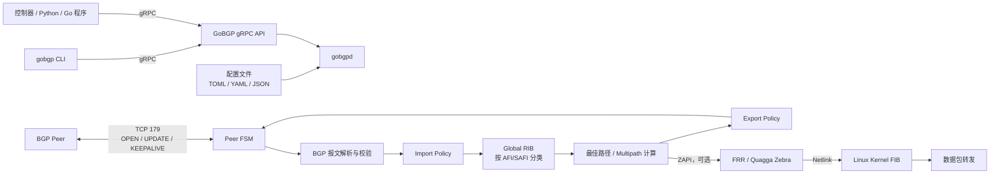

# GoBGP的使用

参考:

- [GoBGP Github](https://github.com/osrg/gobgp)

GoBGP 是一个用 Go 实现的 BGP 控制平面。它负责建立 BGP 会话、交换路由、执行策略和最佳路径计算；它本身不转发业务报文。若要让 Linux 真正按照 GoBGP 学到的路由转发，需要通过 FRR/Quagga Zebra，或者由外部程序通过 gRPC 读取路由后写入内核 FIB。

## 1. 整体架构

