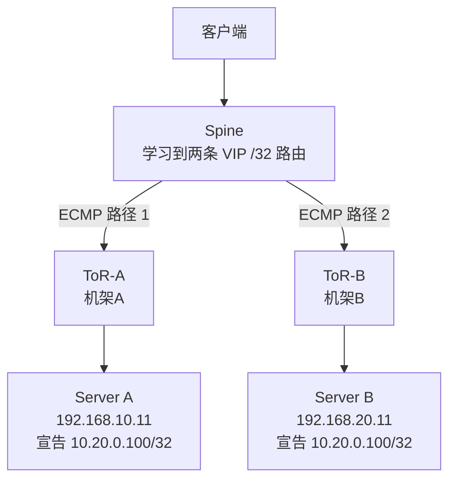

# 如何理解GoBGP宣告VIP更适合跨机架三层网络

在前文《两种VIP高可用实现方式对比》中有提到“GoBGP宣告VIP更适合跨机架、三层网络”，其核心含义是：
> GoBGP 宣告的是“到 VIP 的路由”，因此服务器不必和 VIP、客户端处于同一个二层广播域。只要三层路由可达，服务器可以位于不同子网、不同机架。

## 1. 传统 VIP 为什么依赖二层网络
假设有服务器A，对应的VIP是`10.20.0.100`:
```text
机架 A
eth0：10.20.0.11/24
VIP： 10.20.0.100/24
```
客户端要访问该VIP时，通常会发送ARP: 

```text
谁拥有 10.20.0.100？
```

服务器 A 回答自己的 MAC：
```text
10.20.0.100 在 aa:bb:cc:dd:ee:ff
```
这要求客户端、VIP 持有者或对应网关之间存在二层邻接关系。

如果要把 VIP 漂移到机架 B：
```text
机架 B
eth0：10.20.0.12/24
```
通常需要：
- 机架 A 和机架 B 延伸同一个 VLAN。
- 服务器 B 绑定 VIP。
- 服务器 B 发送 Gratuitous ARP。
- 网络更新 VIP 对应的 MAC 和端口。

>ps: Gratuitous ARP, 一种特殊的 ARP 请求报文，主机发送以自己 IP 地址为目标 IP 地址的 ARP 广播，主要用于 IP 地址冲突检测、更新其他设备的 ARP 缓存以及网络冗余切换通知

拓扑相当于:
```text
机架A                             机架B
服务器A ───── VLAN 100二层延伸 ───── 服务器B
              VIP所在广播域
```

如果数据中心在每个 ToR 处划分三层边界：

```text
机架A：192.168.10.0/24
机架B：192.168.20.0/24
```
服务器 A 和服务器 B 已经不在同一个二层广播域，传统 VRRP/GARP 式 VIP 漂移就难以直接工作。通常需要 VLAN Stretch、VXLAN/EVPN、Proxy ARP 等额外机制。

>ps: ToR 是 Top-of-Rack Switch（机架顶部交换机），指部署在服务器机架内、负责连接该机架中所有服务器的交换机

## 2. GoBGP 如何解除二层限制

假设服务器分别位于不同网段：

```bash
机架 A：
  Server A：192.168.10.11
  ToR-A：  192.168.10.1

机架 B：
  Server B：192.168.20.11
  ToR-B：  192.168.20.1

业务 VIP：
  10.20.0.100/32
```
两台服务器分别向本机架的 ToR 宣告同一个 VIP：

```bash
Server A → ToR-A：10.20.0.100/32 经由 Server A
Server B → ToR-B：10.20.0.100/32 经由 Server B
```



