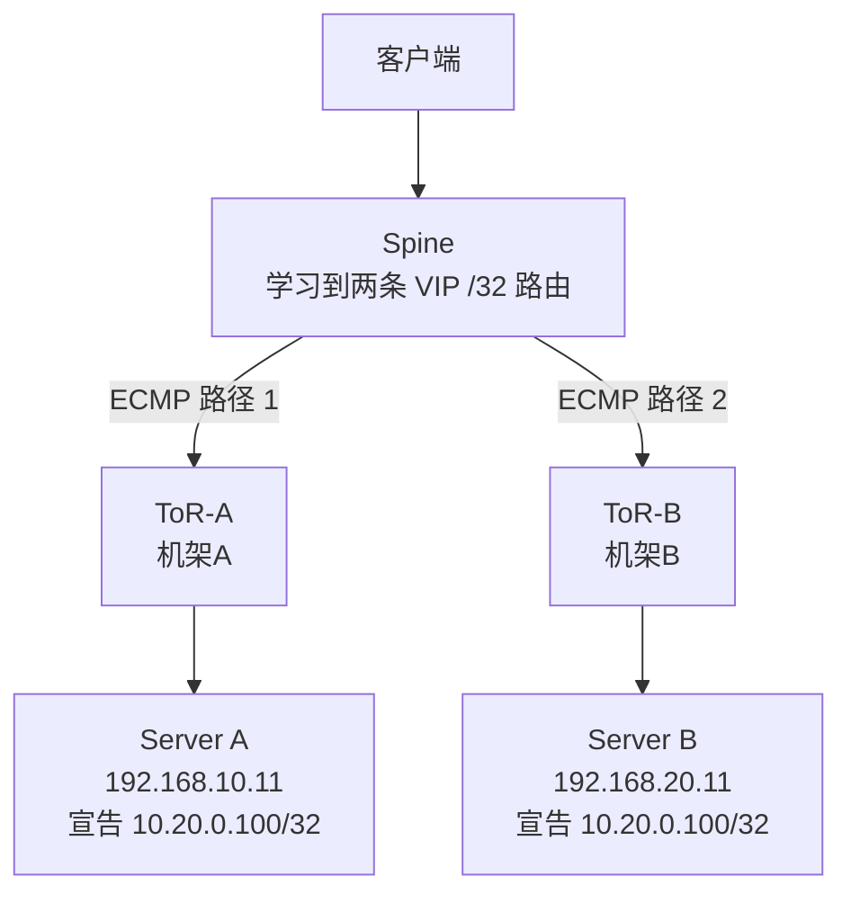

# 如何理解GoBGP宣告VIP更适合跨机架三层网络

在前文《两种VIP高可用实现方式对比》中有提到“GoBGP宣告VIP更适合跨机架、三层网络”，其核心含义是：
> GoBGP 宣告的是“到 VIP 的路由”，因此服务器不必和 VIP、客户端处于同一个二层广播域。只要三层路由可达，服务器可以位于不同子网、不同机架。

## 1. 传统 VIP 为什么依赖二层网络
假设有服务器A，对应的VIP是`10.20.0.100`:
```text
机架 A
eth0：10.20.0.11/24
VIP： 10.20.0.100/24
```
客户端要访问该VIP时，通常会发送ARP: 

```text
谁拥有 10.20.0.100？
```

服务器 A 回答自己的 MAC：
```text
10.20.0.100 在 aa:bb:cc:dd:ee:ff
```
这要求客户端、VIP 持有者或对应网关之间存在二层邻接关系。

如果要把 VIP 漂移到机架 B：
```text
机架 B
eth0：10.20.0.12/24
```
通常需要：
- 机架 A 和机架 B 延伸同一个 VLAN。
- 服务器 B 绑定 VIP。
- 服务器 B 发送 Gratuitous ARP。
- 网络更新 VIP 对应的 MAC 和端口。

>ps: Gratuitous ARP, 一种特殊的 ARP 请求报文，主机发送以自己 IP 地址为目标 IP 地址的 ARP 广播，主要用于 IP 地址冲突检测、更新其他设备的 ARP 缓存以及网络冗余切换通知

拓扑相当于:
```text
机架A                             机架B
服务器A ───── VLAN 100二层延伸 ───── 服务器B
              VIP所在广播域
```

如果数据中心在每个 ToR 处划分三层边界：

```text
机架A：192.168.10.0/24
机架B：192.168.20.0/24
```
服务器 A 和服务器 B 已经不在同一个二层广播域，传统 VRRP/GARP 式 VIP 漂移就难以直接工作。通常需要 VLAN Stretch、VXLAN/EVPN、Proxy ARP 等额外机制。

>ps: ToR 是 Top-of-Rack Switch（机架顶部交换机），指部署在服务器机架内、负责连接该机架中所有服务器的交换机

## 2. GoBGP 如何解除二层限制

假设服务器分别位于不同网段：

```bash
机架 A：
  Server A：192.168.10.11
  ToR-A：  192.168.10.1

机架 B：
  Server B：192.168.20.11
  ToR-B：  192.168.20.1

业务 VIP：
  10.20.0.100/32
```
两台服务器分别向本机架的 ToR 宣告同一个 VIP：

```bash
Server A → ToR-A：10.20.0.100/32 经由 Server A
Server B → ToR-B：10.20.0.100/32 经由 Server B
```

上游网络看到：

```text
10.20.0.100/32
  ├─ 下一跳：ToR-A → Server A
  └─ 下一跳：ToR-B → Server B
```

整个过程中：
- 机架 A 与机架 B 不需要共享 VLAN。
- 两台服务器可以使用完全不同的接口网段。
- VIP 不需要在两个机架之间进行 MAC 漂移。
- 网络根据三层路由将流量送到正确机架。

## 3. 数据包具体如何转发
客户端访问：
```text
10.20.0.100
```
数据包路径可能是：
```text
客户端
  → 客户端默认网关
  → Spine查找10.20.0.100/32
  → ECMP选择ToR-A
  → ToR-A选择Server A
  → Server A接收VIP流量
```
另一个五元组不同的连接可能走：

```text
客户端
  → 默认网关
  → Spine
  → ToR-B
  → Server B
```

这里的 ARP 只发生在每一段本地链路上：

```text
客户端 ARP 默认网关
ToR-A ARP Server A 的接口地址
ToR-B ARP Server B 的接口地址
```
客户端不需要知道 VIP 对应哪台服务器的 MAC。每经过一个三层设备，二层 MAC 会被重新封装，而目标 IP 10.20.0.100 保持不变。

## 4. 故障时发生什么

如果 Server A 服务异常，它撤销路由：

```text
gobgp global rib del 10.20.0.100/32
```
网络路由从：

```text
10.20.0.100/32
  ├─ Server A
  └─ Server B
```
变成:

```text
10.20.0.100/32
  └─ Server B
```

之后的新流量只会进入机架 B。整个切换不依赖 GARP，也不要求其他机架刷新 VIP 的 ARP 缓存。

## 5. 为什么 /32 很重要

服务器一般发布 VIP 的精确主机路由：

```text
10.20.0.100/32
```

上游可能已有业务网段聚合路由：

```text
10.20.0.0/16 → 其他方向
```

因为最长前缀匹配：

```text
/32 比 /16 更精确
```

所以只有发往 10.20.0.100 的流量会被引向 GoBGP 节点，其他 10.20.x.x 地址仍按照原来的 /16 路由转发。

## 6. 一个重要前提
客户端不能把 VIP 视为自己的本地二层地址，否则客户端可能直接 ARP VIP，而不把数据包交给默认网关。

例如客户端是：
```text
客户端：10.20.0.50/24
VIP：   10.20.0.100
```
客户端会认为 VIP 在本地 /24：

```text
10.20.0.100 属于我的直连网段
→ 直接发送ARP
→ 不查询三层路由器
```

此时上游设备学到的 /32 BGP 路由可能没有机会生效。

比较典型的设计是：

```text
客户端网段：192.168.100.0/24
VIP地址池： 10.20.0.0/24
实际发布：  10.20.0.100/32
```

这样客户端访问 VIP 时必然先交给默认网关，再由三层网络查找 BGP 路由。

## 7. 本质区别

- 传统 VIP

```text
VIP在哪里？
→ 查询哪个MAC拥有它
→ 地址位置与二层广播域绑定
```

- GoBGP VIP

```text
VIP在哪里？
→ 查询路由表中哪个下一跳能够到达它
→ 地址位置由路由控制，不受机架或子网限制
```
所以“跨机架、三层网络”并不是指 GoBGP 能无条件穿越任何网络，而是指只要服务器能与 ToR 建立 BGP、下一跳可达，并且整个网络接受这些 /32 路由，就不需要把 VIP 所在的 VLAN 延伸到所有机架。
  


